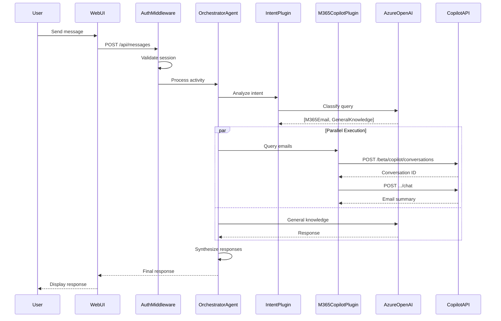

# Microsoft 365 Copilot Chat API + Agents SDK Lab

> **🚀 Quick Start Options:**
> - [Local Development](QUICK_START_LOCAL.md) — Run locally in 10 minutes
> - [Azure Deployment](QUICK_START.md) — Deploy to Azure with Teams integration

## Why Microsoft 365 Copilot in Your Agent Architecture?

As AI applications evolve toward **multi-agent architectures**, the question isn't whether to use multiple agents—it's which agents provide the most value. **Microsoft 365 Copilot** offers unique capabilities that no custom RAG pipeline can easily replicate:

- **Enterprise Data Grounding** — Responses based on real emails, meetings, files, and org data
- **Built-in Security** — Respects M365 permissions; no separate access control layer needed
- **Semantic M365 Understanding** — Knows relationships between people, meetings, documents, and conversations
- **Zero Pipeline Maintenance** — No vector databases or embedding pipelines for M365 content

This lab demonstrates how to build a **.NET 10 Agent** using the **Microsoft 365 Agents SDK** with **Semantic Kernel** orchestration, integrating M365 Copilot as a specialist agent.

## Architecture Overview

```
┌─────────────────────────────────────────────────────────────┐
│                    MULTI-CHANNEL CLIENTS                    │
│        Teams  |  M365 Copilot  |  Web  |  Slack             │
└─────────────────────────────────────────────────────────────┘
                              │
                    Activity Protocol
                              │
┌─────────────────────────────────────────────────────────────┐
│              MICROSOFT 365 AGENTS SDK                       │
│                                                             │
│  ┌───────────────────────────────────────────────────────┐  │
│  │         OrchestratorAgent : AgentApplication          │  │
│  │                                                       │  │
│  │   OnActivity(Message) → Semantic Kernel → Plugins     │  │
│  └───────────────────────────────────────────────────────┘  │
│                              │                              │
│  ┌───────────────────────────────────────────────────────┐  │
│  │               SEMANTIC KERNEL PLUGINS                 │  │
│  │  IntentPlugin | AzureOpenAIPlugin | M365CopilotPlugin │  │
│  └───────────────────────────────────────────────────────┘  │
└─────────────────────────────────────────────────────────────┘
           │                                    │
           ▼                                    ▼
┌─────────────────────┐          ┌─────────────────────────────┐
│   AZURE OPENAI      │          │   M365 COPILOT CHAT API     │
│   (GPT-4o)          │          │   (/beta/copilot via Kiota) │
└─────────────────────┘          └─────────────────────────────┘
```

## Technology Stack

| Component | Technology |
|-----------|------------|
| **Agent Framework** | Microsoft 365 Agents SDK 1.1.x |
| **Orchestration** | Semantic Kernel 1.54.x |
| **AI Model** | Azure OpenAI (GPT-4o) |
| **M365 Integration** | Microsoft Graph Copilot Chat API |
| **Runtime** | .NET 10 |

## Quick Start

### Prerequisites

- .NET 10 SDK (Preview - see note below)
- Microsoft 365 tenant with Copilot license
- Azure subscription with Azure OpenAI access
- Azure AD app registration

> **Note:** This project uses .NET 10 Preview. The SDK may have breaking changes before GA release. For production deployments, consider targeting .NET 9 (LTS) or monitor the .NET 10 release schedule.

### Setup

1. **Clone the repository:**
   ```bash
   git clone https://github.com/YOUR-ORG/chat_api_lab.git
   cd chat_api_lab
   ```

2. **Run the setup script (recommended):**

   **macOS/Linux:**
   ```bash
   ./scripts/setup-local.sh
   ```

   **Windows (PowerShell):**
   ```powershell
   .\scripts\setup-local.ps1
   ```

   **Or configure manually:**

   ```bash
   cd src/AgentOrchestrator
   dotnet user-secrets init
   dotnet user-secrets set "AzureAd:TenantId" "your-tenant-id"
   dotnet user-secrets set "AzureAd:ClientId" "your-client-id"
   dotnet user-secrets set "AzureAd:ClientSecret" "your-client-secret"
   dotnet user-secrets set "AzureOpenAI:Endpoint" "https://your-resource.openai.azure.com/"
   dotnet user-secrets set "AzureOpenAI:ApiKey" "your-api-key"
   dotnet user-secrets set "AzureOpenAI:DeploymentName" "gpt-4o"
   ```

3. **Run the application:**
   ```bash
   cd src/AgentOrchestrator
   dotnet run --urls "http://localhost:5001"
   ```

4. **Open your browser:**
   Navigate to `http://localhost:5001` (port 5000 may conflict with macOS AirPlay)

5. **Login and start chatting!**

## Features

- **M365 Agents SDK** - Enterprise-grade agent framework with multi-channel support
- **Semantic Kernel Plugins** - Clean AI function architecture
- **Multi-Intent Detection** - Routes queries to appropriate plugins
- **Parallel Execution** - Multiple plugins execute concurrently
- **M365 Copilot Integration** - Query emails, calendar, files, and people

## Example Queries

| Query Type | Example |
|------------|---------|
| Email | "Summarize my unread emails from this week" |
| Calendar | "What meetings do I have tomorrow?" |
| Files | "Find the latest project proposal document" |
| People | "Who has expertise in Azure in my team?" |
| General | "Explain what microservices are" |
| Multi-Intent | "Summarize my emails and explain REST APIs" |

## Project Structure

```
src/AgentOrchestrator/
├── Program.cs                 # App entry, DI, agent registration
├── Agent/
│   └── OrchestratorAgent.cs   # AgentApplication implementation
├── Plugins/                   # Semantic Kernel plugins
│   ├── IntentPlugin.cs
│   ├── AzureOpenAIPlugin.cs
│   ├── M365CopilotPlugin.cs
│   └── SynthesisPlugin.cs
├── CopilotSdk/                # Kiota-generated API client
├── Auth/                      # Authentication components
├── Security/                  # Security utilities
│   └── InputSanitizer.cs      # Prompt injection protection
├── Models/                    # Data models
└── wwwroot/                   # Web UI
```

## Documentation

- [Design Document](DESIGN.md)
- [Self-Paced Lab Guide](docs/self-paced/LAB_GUIDE.md)
- [Prerequisites](docs/self-paced/PREREQUISITES.md)
- [Troubleshooting](docs/self-paced/TROUBLESHOOTING.md)
- [Instructor Guide](docs/instructor-led/FACILITATOR_GUIDE.md)

## Key Concepts

### Microsoft 365 Agents SDK

The M365 Agents SDK provides the foundation for building enterprise agents:
- **AgentApplication** - Base class for agent logic
- **Activity Protocol** - Standard message format (Bot Framework compatible)
- **Multi-Channel** - Deploy to Teams, M365 Copilot, Web, Slack, and more

### Semantic Kernel

Semantic Kernel provides AI orchestration:
- **Plugins** - Encapsulate AI functions with `[KernelFunction]` attributes
- **Kernel** - Manages AI services and plugin invocation
- **Prompts** - Natural language templates for LLM interactions

### M365 Copilot Chat API

The Copilot Chat API (`/beta/copilot/conversations`) enables:
- Programmatic access to M365 Copilot via Kiota-generated SDK
- Enterprise data grounding (emails, calendar, files, people)
- Synchronous conversational interactions

---

## Deployment

### Local Development

For local development, run with the Development environment:

```bash
cd src/AgentOrchestrator
ASPNETCORE_ENVIRONMENT=Development dotnet run
```

### Deploy to Azure (Teams & Copilot)

To deploy as a Microsoft Teams bot or M365 Copilot agent:

1. **Azure App Service** - Host your .NET 10 application
2. **Azure Bot Service** - Provides channel integration (Teams, Copilot, Web Chat)
3. **Teams App Package** - Manifest for Microsoft Teams

See **[Azure Deployment Guide](docs/AZURE_DEPLOYMENT.md)** for complete step-by-step instructions.

```
src/AgentOrchestrator/
├── appsettings.json      # Includes Bot Service connection config
└── appPackage/
    ├── manifest.json     # Teams/Copilot app manifest
    ├── color.png         # App icon (192x192)
    └── outline.png       # App icon (32x32)
```

---

## For Lab Participants

### Security Features

This lab implements production-grade security practices:

| Feature | Implementation |
|---------|----------------|
| **Token Encryption** | AES-256 encryption at rest using PBKDF2-derived keys |
| **Session Cleanup** | Automatic TTL-based cleanup (8hr session, 15min cleanup interval) |
| **Prompt Injection Protection** | Input sanitization with XML delimiters and suspicious pattern detection |
| **CSRF Protection** | Cryptographically secure state parameter using `RandomNumberGenerator` |
| **Error Handling** | Generic error messages to users; detailed logging server-side |
| **Swagger Protection** | API documentation only available in Development environment |
| **Thread-Safe Token Refresh** | Per-session semaphores prevent concurrent refresh race conditions |

### Security Markers in Code

Pay attention to these markers in the code:

| Marker | Meaning |
|--------|---------|
| `// SECURITY:` | Security best practices - important to understand |
| `// LAB SIMPLIFICATION:` | Patterns that need hardening for production |
| `// PRODUCTION:` | What you'd do differently in production |

**Key differences from production code:**
- **Secrets:** Lab uses `appsettings.json` template; production uses Azure Key Vault
- **Token Cache:** Lab encrypts in-memory; production uses Redis with encryption
- **Session Storage:** Lab uses in-memory; production uses distributed cache
- **HTTP:** Lab runs on HTTP locally; production requires HTTPS

### Common Issues

See [TROUBLESHOOTING.md](docs/self-paced/TROUBLESHOOTING.md) for solutions to common problems.

### Request Flow Diagram



### Learning Objectives

After completing this lab, you should understand:

1. **Microsoft 365 Agents SDK** - How to build agents using `AgentApplication`
2. **Semantic Kernel** - Plugin pattern with `[KernelFunction]` attributes
3. **OAuth 2.0** - Authorization code flow with MSAL
4. **M365 Copilot Chat API** - Two-step conversation pattern
5. **Resilience Patterns** - Retry, circuit breaker, and timeout handling

## License

This lab is provided for educational purposes.
